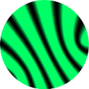

# Quantum Interference ⚛️



**Quantum Interference** is a generative art experiment that artistically portrays the interference patterns of quantum mechanics from a quantum computing perspective. Built for the **#UnitaryDESIGN** hackathon for project **"QuantumBrush"**.

## 🚀 Overview
The application simulates a quantum system with $n$ qubits. Users can manipulate the state of the system by injecting quantum gates (H, X, S, T, CNOT, CCNOT) and observe the resulting probability amplitude field as a beautiful, evolving interference pattern.

## 🛠️ Tech Stack
- **Runtime**: [Bun](https://bun.sh)
- **Framework**: [Next.js](https://nextjs.org) (App Router)
- **Logic**: Vanilla JavaScript
- **Styling**: Tailwind CSS
- **Visuals**: HTML5 Canvas (Hardware accelerated)

## 📡 The Algorithm: StateVector to Image
The visualizer maps purely mathematical quantum states into a physical wave interference field:

1. **Source Mapping**: Each of the $2^n$ computational basis states ($|00...0\rangle$ to $|11...1\rangle$) is mapped to a spatial coordinate $\mathbf{r}_i$ arranged in a circular formation.
2. **Wave Emission**: Each state acts as a point source emitting a wave. The "strength" of the source is determined by its **Probability Amplitude** $c_i$:
   - **Amplitude magnitude ($|c_i|$)**: Controls the wave's peak intensity.
   - **Amplitude phase ($\phi_i$)**: Controls the wave's phase shift.
3. **Interference Calculation**: For every pixel $\mathbf{r}$ on the canvas, the total wave function $\Psi$ is the complex sum of all contributions:
   $$\Psi(\mathbf{r}, t) = \sum_{i} |c_i| e^{j(k|\mathbf{r} - \mathbf{r}_i| - \omega t - \phi_i)}$$
4. **Rendering**: The final pixel intensity is calculated as $I = |\Psi|^2$. This intensity is mapped to a matrix-inspired color gradient (Deep Dark to Neon Green) and rendered in real-time.

## ⚙️ Installation

First, ensure you have [Bun](https://bun.sh) installed.

```bash
# Clone the repository
git clone https://github.com/your-username/quantum-brush.git
cd quantum-brush

# Install dependencies
bun install

# Run the development server
bun run dev
```

Open [http://localhost:3000](http://localhost:3000) with your browser to see the result.

## 🎨 Controls
- **Qubits**: Scale the complexity of the Hilbert space.
- **Wave Dynamics**: Adjust the Wave Number ($k$) for spatial frequency and Frequency ($\omega$) for temporal speed.
- **Inject Gate**: Apply unitary transformations to perturb the field and create entanglement.
- **Download**: Capture the current interference pattern as a high-resolution PNG.

## 📜 License
MIT

## ✒️​ Authorship
Created by **Luis J Camargo** for the **#UnitaryDESIGN** hackathon.
Copyleft 2026.
